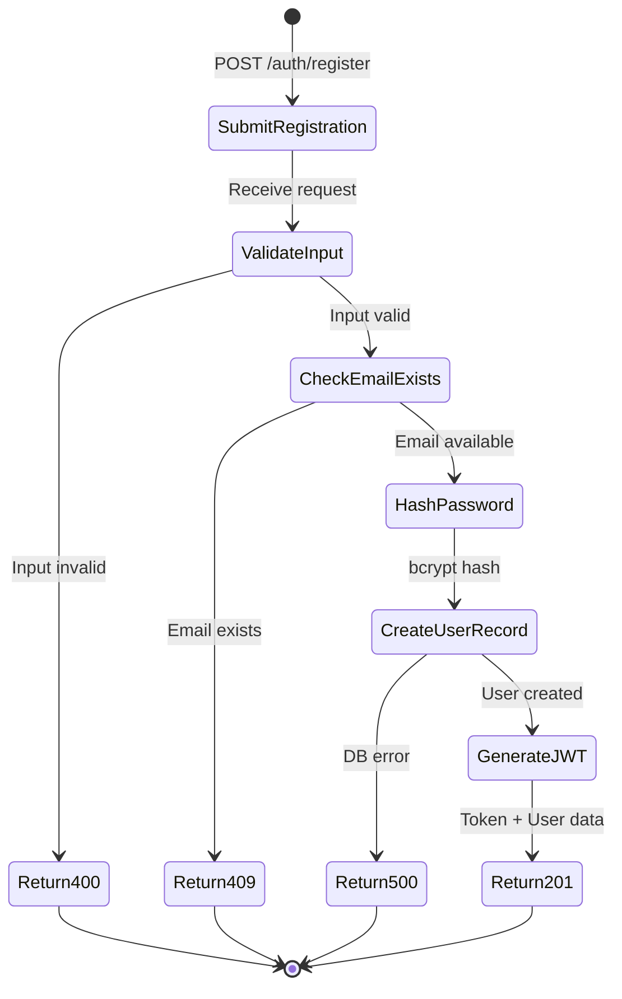
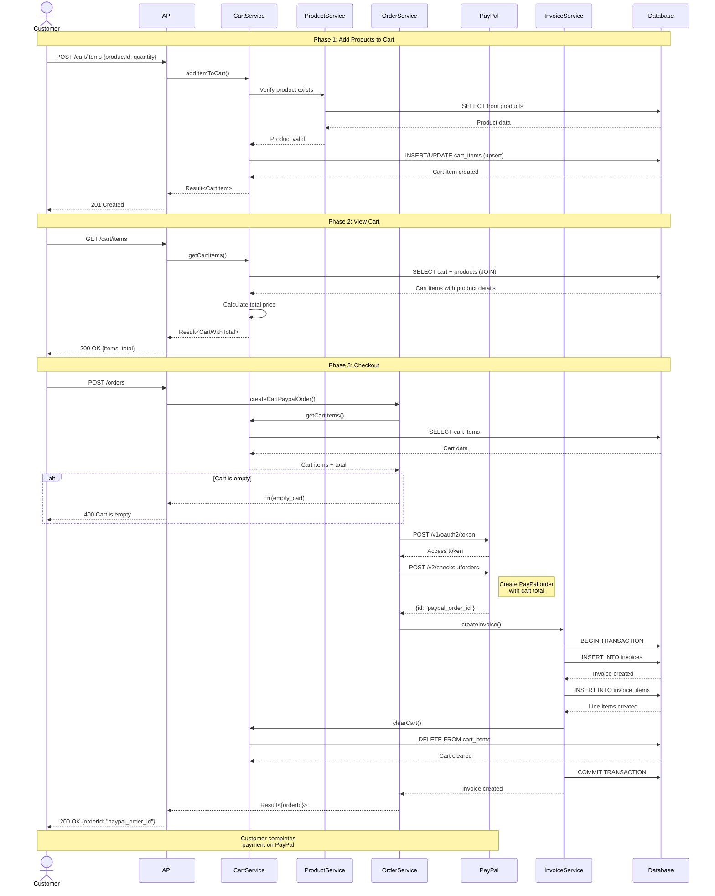
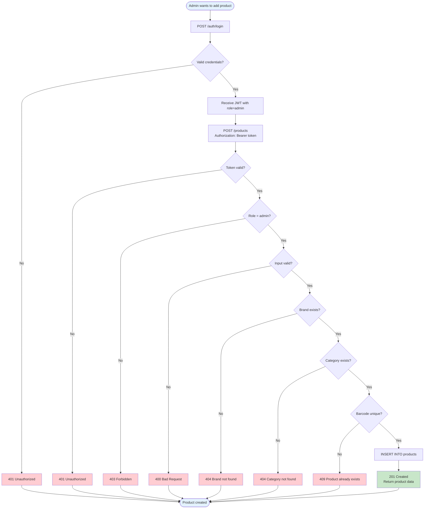
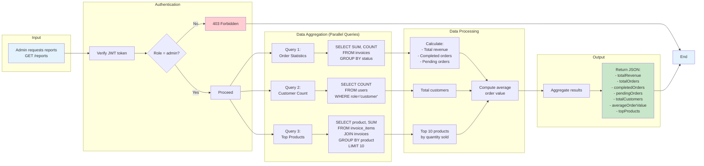
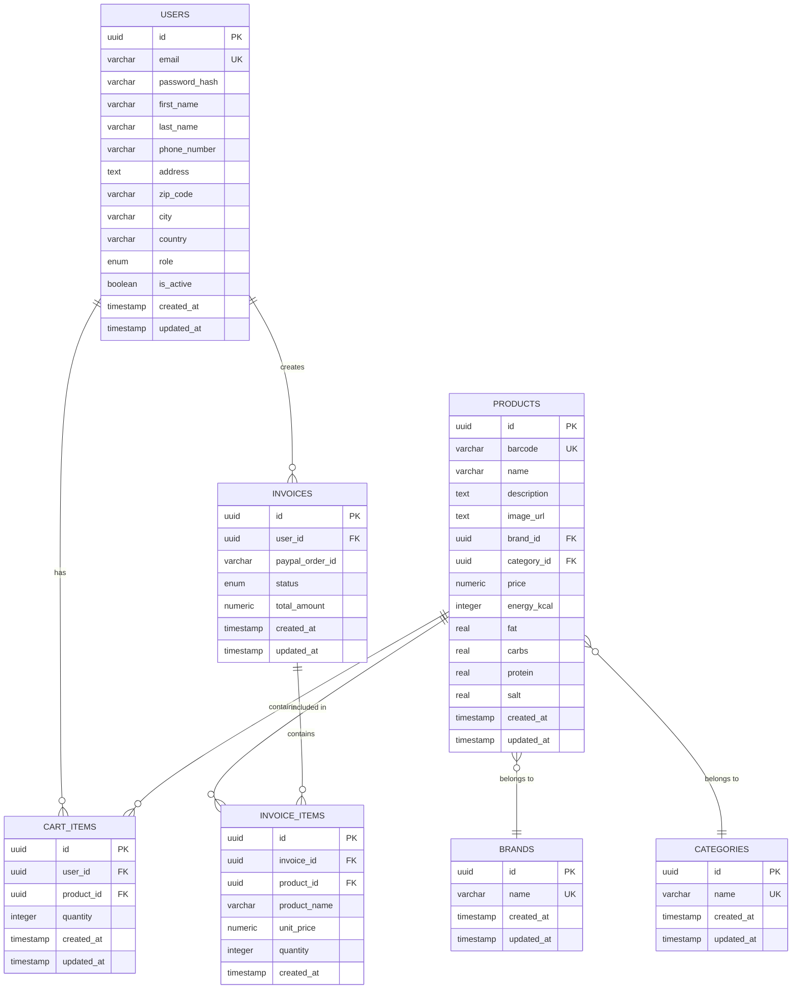
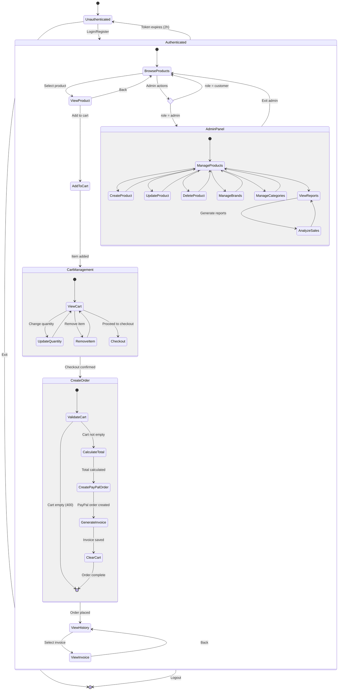

# API Documentation

## Technical Documentation

### Architecture Overview

Trinity API is a **modular REST API** built with a modern, type-safe architecture following **hexagonal (ports and adapters)** design principles. The application is structured into independent, composable modules that handle specific business domains.

#### Architectural Layers

```
┌─────────────────────────────────────────────────────────────┐
│                    HTTP Layer (Elysia)                      │
│  - CORS, OpenAPI, Request/Response Handling                 │
└────────────────────────┬────────────────────────────────────┘
                         │
┌────────────────────────┴────────────────────────────────────┐
│                    Module Layer                             │
│  ┌──────────┐ ┌──────────┐ ┌──────────┐ ┌──────────┐      │
│  │  Auth    │ │ Products │ │   Cart   │ │  Orders  │      │
│  └──────────┘ └──────────┘ └──────────┘ └──────────┘      │
│  ┌──────────┐ ┌──────────┐ ┌──────────┐ ┌──────────┐      │
│  │  Users   │ │  Brands  │ │Categories│ │ Invoices │      │
│  └──────────┘ └──────────┘ └──────────┘ └──────────┘      │
│  ┌──────────┐ ┌──────────┐                                 │
│  │ Reports  │ │  Health  │                                 │
│  └──────────┘ └──────────┘                                 │
└────────────────────────┬────────────────────────────────────┘
                         │
┌────────────────────────┴────────────────────────────────────┐
│                  Service Layer                              │
│  - Business Logic                                           │
│  - Error Handling (neverthrow Result types)                 │
│  - Transaction Management                                   │
└────────────────────────┬────────────────────────────────────┘
                         │
┌────────────────────────┴────────────────────────────────────┐
│               Data Access Layer (Drizzle ORM)               │
│  - Type-safe SQL queries                                    │
│  - Schema definitions                                       │
│  - Migrations                                               │
└────────────────────────┬────────────────────────────────────┘
                         │
┌────────────────────────┴────────────────────────────────────┐
│                PostgreSQL Database                          │
└─────────────────────────────────────────────────────────────┘
```

### Components

#### 1. Core Modules

**Authentication Module** (`/auth`)
- User registration with bcrypt password hashing
- JWT-based login (HS256, 2-hour expiration)
- Token generation and verification
- Role-based access control (customer, admin)

**Users Module** (`/users`)
- User CRUD operations
- Profile management (address, phone, billing info)
- Admin user management
- Self-service profile updates

**Products Module** (`/products`)
- Product catalog management
- Barcode-based product lookup
- Nutritional information storage
- Brand and category relationships

**Brands Module** (`/brands`)
- Brand CRUD operations
- Cascade deletion handling

**Categories Module** (`/categories`)
- Category CRUD operations
- Product categorization

**Cart Module** (`/cart`)
- Shopping cart management
- Quantity updates with upsert logic
- Cart totaling with price calculations
- User-specific cart isolation

**Orders Module** (`/orders`)
- PayPal integration for payment processing
- Order creation from cart
- Invoice generation
- Cart clearing post-purchase

**Invoices Module** (`/invoices`)
- Invoice tracking (pending/completed)
- Line item management
- User-specific invoice retrieval
- Admin invoice oversight

**Reports Module** (`/reports`)
- Revenue analytics
- Order statistics (completed/pending)
- Customer metrics
- Top-selling products analysis

**Health Module** (`/health`)
- API status endpoint
- Database connectivity checks
- System monitoring

#### 2. Cross-Cutting Concerns

**Authentication Middleware** (`authGuard`)
- Bearer token extraction from Authorization header
- JWT verification
- Role-based access enforcement (admin/customer)
- Request context injection (`userId`, `role`)

**Database Plugin**
- Singleton database connection management
- Transaction support
- Elysia plugin integration
- Schema-aware query builder

**Error Handling**
- Structured error types per module
- `neverthrow` Result monad pattern
- Database constraint error mapping (unique violations, foreign key violations)
- HTTP status code consistency

**Environment Configuration**
- Type-safe environment variables with `@t3-oss/env-core`
- Zod schema validation
- Required variables: `DATABASE_URL`, `JWT_SECRET`, PayPal credentials

### Technological Choices

#### Runtime & Framework
- **Bun**: Ultra-fast JavaScript runtime with native TypeScript support
  - **Rationale**: 3x faster than Node.js, built-in bundler, native TS execution
- **Elysia.js**: High-performance web framework optimized for Bun
  - **Rationale**: Best-in-class type safety, ~20x faster than Express, plugin architecture

#### Database Stack
- **PostgreSQL**: Relational database
  - **Rationale**: ACID compliance, robust constraints, proven scalability
- **Drizzle ORM**: TypeScript-first ORM
  - **Rationale**: Compile-time type safety, zero runtime overhead, SQL-like syntax
- **Bun SQL Driver**: Native PostgreSQL adapter
  - **Rationale**: Optimized for Bun runtime, connection pooling

#### Language & Type Safety
- **TypeScript**: Strict mode enabled
  - **Rationale**: Compile-time error detection, IDE support, refactoring safety
- **Zod**: Runtime schema validation
  - **Rationale**: Type inference, OpenAPI integration, input sanitization
- **neverthrow**: Result type implementation
  - **Rationale**: Railway-oriented programming, explicit error handling, no exceptions

#### Security
- **bcryptjs**: Password hashing (10 rounds)
  - **Rationale**: Industry standard, resistant to rainbow tables
- **jose**: JWT operations
  - **Rationale**: Standards-compliant, secure defaults, type-safe
- **CORS**: Cross-origin resource sharing
  - **Rationale**: Secure mobile app integration

#### External Integrations
- **PayPal REST API**: Payment processing
  - **Rationale**: Trusted payment gateway, international support, sandbox testing

#### API Design
- **OpenAPI/Swagger**: Automatic documentation generation
  - **Rationale**: Interactive testing, client code generation, API contracts
- **RESTful conventions**: Resource-based URLs, HTTP verbs
  - **Rationale**: Predictable API surface, caching support

### Data Flow

#### 1. Request Lifecycle

```
Client Request
     │
     ▼
┌─────────────────────┐
│  HTTP Entry Point   │
│  (Elysia Routing)   │
└──────────┬──────────┘
           │
           ▼
┌─────────────────────┐
│   CORS Validation   │
└──────────┬──────────┘
           │
           ▼
┌─────────────────────┐
│  Auth Middleware    │◄──── Bearer Token
│  (if protected)     │
└──────────┬──────────┘
           │
           ▼
┌─────────────────────┐
│  Input Validation   │◄──── Zod Schema
│  (body/params)      │
└──────────┬──────────┘
           │
           ▼
┌─────────────────────┐
│  Module Handler     │
│  (Route Logic)      │
└──────────┬──────────┘
           │
           ▼
┌─────────────────────┐
│  Database           │◄──── Transaction
│  Transaction        │
└──────────┬──────────┘
           │
           ▼
┌─────────────────────┐
│  Service Layer      │
│  (Business Logic)   │
└──────────┬──────────┘
           │
           ▼
┌─────────────────────┐
│  Drizzle ORM        │
│  SQL Execution      │
└──────────┬──────────┘
           │
           ▼
┌─────────────────────┐
│    PostgreSQL       │
└──────────┬──────────┘
           │
           ▼
┌─────────────────────┐
│  Result Mapping     │◄──── neverthrow Result
│  (Ok/Err)           │
└──────────┬──────────┘
           │
           ▼
┌─────────────────────┐
│  HTTP Response      │
│  (JSON + Status)    │
└──────────┬──────────┘
           │
           ▼
      Client Response
```

#### 2. Authentication Flow

```
┌─────────────────┐         ┌─────────────────┐
│  Client Request │────────▶│  Auth Module    │
│  (POST /login)  │         │                 │
└─────────────────┘         └────────┬────────┘
                                     │
                            ┌────────▼────────┐
                            │  Validate Input │
                            │  (email/pwd)    │
                            └────────┬────────┘
                                     │
                            ┌────────▼────────┐
                            │  Query User DB  │
                            │  (by email)     │
                            └────────┬────────┘
                                     │
                            ┌────────▼────────┐
                            │  bcrypt.compare │
                            │  (password)     │
                            └────────┬────────┘
                                     │
                         ┌───────────┴───────────┐
                         │                       │
                    ┌────▼─────┐           ┌────▼─────┐
                    │  Match?  │           │  Match?  │
                    │   YES    │           │    NO    │
                    └────┬─────┘           └────┬─────┘
                         │                       │
                    ┌────▼─────┐           ┌────▼─────┐
                    │ Generate │           │  Return  │
                    │   JWT    │           │   401    │
                    │ (2h exp) │           └──────────┘
                    └────┬─────┘
                         │
                    ┌────▼─────┐
                    │  Return  │
                    │ Token +  │
                    │   User   │
                    └──────────┘
```

#### 3. Protected Endpoint Flow

```
Request with Authorization: Bearer <token>
     │
     ▼
┌─────────────────────┐
│  Extract Token      │
│  from Header        │
└──────────┬──────────┘
           │
           ▼
┌─────────────────────┐
│  JWT Verification   │◄──── JWT_SECRET
│  (jose.jwtVerify)   │
└──────────┬──────────┘
           │
     ┌─────┴─────┐
     │           │
┌────▼─────┐ ┌──▼────────┐
│  Valid?  │ │  Invalid  │
│   YES    │ │    NO     │
└────┬─────┘ └──┬────────┘
     │          │
     │     ┌────▼─────┐
     │     │ Return   │
     │     │   401    │
     │     └──────────┘
     │
┌────▼─────────┐
│  Extract     │
│  userId,role │
└────┬─────────┘
     │
┌────▼─────────┐
│  Role Check  │
│  (if needed) │
└────┬─────────┘
     │
┌────┴─────┐
│          │
▼          ▼
Authorized  403 Forbidden
```

#### 4. Database Interaction Pattern

Every database operation follows this pattern:

```typescript
// Transaction wrapper ensures ACID properties
database.transaction(async (tx) => {
  // Service function returns Result<T, E>
  return await service.operation(tx, params);
})
.match(
  // Success path
  (data) => status(200, data),
  // Error path with typed errors
  (error) => {
    switch (error.type) {
      case "specific_error":
        return status(404, "Resource not found");
      case "another_error":
        return status(500, "Internal error");
    }
  }
)
```

**Key characteristics**:
- All DB operations wrapped in transactions
- Railway-oriented programming (Result monad)
- Type-safe error handling
- Automatic rollback on errors
- No exceptions thrown

#### 5. Error Propagation

```
Database Error (PostgreSQL)
     │
     ▼
┌─────────────────────┐
│  SQL Error          │
│  (23505, 23503...)  │
└──────────┬──────────┘
           │
           ▼
┌─────────────────────┐
│  Drizzle catches    │
│  DrizzleQueryError  │
└──────────┬──────────┘
           │
           ▼
┌─────────────────────┐
│  errorMapper()      │
│  Maps to domain err │
└──────────┬──────────┘
           │
           ▼
┌─────────────────────┐
│  Result.err()       │
│  Typed error object │
└──────────┬──────────┘
           │
           ▼
┌─────────────────────┐
│  Route Handler      │
│  Pattern matches    │
└──────────┬──────────┘
           │
           ▼
┌─────────────────────┐
│  HTTP Error         │
│  (appropriate code) │
└─────────────────────┘
```

## UML Diagrams

### 1. User Registration Workflow



### 2. Shopping Cart to Order Workflow



### 3. Product Management Workflow (Admin)



### 4. Admin Reports Generation Workflow



### 5. Data Model Entity Relationships



### 6. Complete System Activity Diagram



## API Endpoints Summary

### Public Endpoints
- `GET /` - Welcome message
- `GET /health` - Health check with database status
- `POST /auth/register` - User registration
- `POST /auth/login` - User authentication

### Customer Endpoints (requires `role=customer`)
- `GET /products` - List all products
- `GET /products/:id` - Get product by ID
- `GET /products/barcode/:barcode` - Get product by barcode scan
- `POST /cart/items` - Add item to cart
- `PUT /cart/items/:productId` - Update cart item quantity
- `DELETE /cart/items/:productId` - Remove item from cart
- `GET /cart/items` - Get user's cart
- `DELETE /cart/items` - Clear cart
- `POST /orders` - Create order (checkout)
- `GET /invoices/users/:id` - Get user's invoices
- `GET /invoices/:id` - Get invoice details
- `GET /users/me` - Get current user profile
- `PUT /users/me` - Update current user profile
- `GET /brands` - List brands
- `GET /categories` - List categories

### Admin Endpoints (requires `role=admin`)
- `POST /products` - Create product
- `PUT /products/:id` - Update product
- `DELETE /products/:id` - Delete product
- `POST /brands` - Create brand
- `PUT /brands/:id` - Update brand
- `DELETE /brands/:id` - Delete brand
- `POST /categories` - Create category
- `PUT /categories/:id` - Update category
- `DELETE /categories/:id` - Delete category
- `GET /users` - List all users
- `GET /users/:id` - Get user by ID
- `POST /users` - Create user
- `PUT /users/:id` - Update user
- `DELETE /users/:id` - Delete user
- `GET /invoices` - List all invoices
- `GET /reports` - Generate business reports

## Performance Considerations

**Transaction Scope**: All database operations wrapped in transactions for ACID guarantees

**Query Optimization**:
- Indexed columns: email, barcode, user-product combinations
- JOIN operations minimized through service layer composition
- Aggregate queries use native SQL for reports

**Caching Strategy**: None implemented (stateless architecture suitable for serverless)

**Concurrency**: 
- Upsert pattern for cart operations (handles concurrent updates)
- Optimistic locking not required (no long-running transactions)

## Security Considerations

**Authentication**: JWT with 2-hour expiration, HS256 signing
**Authorization**: Role-based middleware guards all protected routes
**Password Storage**: bcrypt with default cost factor (10 rounds)
**Input Validation**: All inputs validated via Zod schemas
**SQL Injection Prevention**: Parameterized queries via Drizzle ORM
**CORS**: Configured to accept credentials, requires client origin validation
**Environment Secrets**: Never committed, validated at startup

## Testing Strategy

**Unit Tests**: Service layer functions tested with Testcontainers
- Isolated PostgreSQL instances per test suite
- Transaction rollback after each test
- Coverage reporting enabled

**Integration Tests**: Full module testing via HTTP requests
- Database state setup and teardown
- Authentication flow testing
- Error condition validation

**Test Environment**: `.env.test` configuration with ephemeral database
