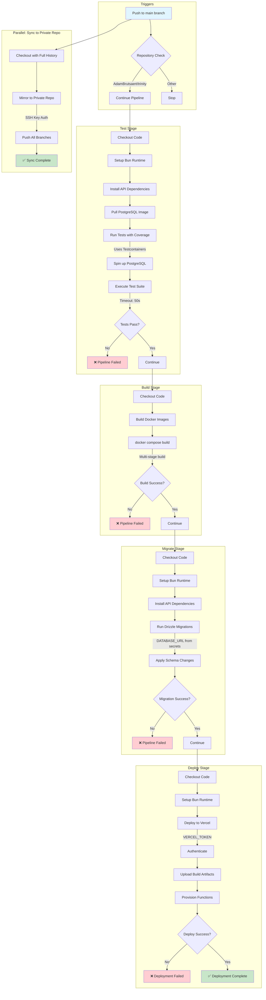

# DevOps Documentation

## Project Technologies and Architecture

### Monorepo Structure
Trinity is a monorepo managed with **Bun workspaces**, containing three main applications:

- **API** (`apps/api`): REST API built with Elysia.js and Bun
- **Mobile** (`apps/mobile`): Cross-platform mobile app using Expo and React Native
- **Seed** (`apps/seed`): Database seeding utility

### Technology Stack

#### Backend (API)
- **Runtime**: Bun
- **Framework**: Elysia.js (modern TypeScript web framework)
- **Database**: PostgreSQL
- **ORM**: Drizzle ORM
- **Authentication**: JWT (jose library)
- **Validation**: Zod
- **Documentation**: OpenAPI/Swagger

#### Mobile
- **Framework**: Expo (React Native)
- **State Management**: Zustand
- **Data Fetching**: TanStack Query
- **API Client**: Eden Treaty (Elysia's type-safe client)

#### Infrastructure
- **Containerization**: Docker & Docker Compose
- **Package Manager**: Bun
- **Linter/Formatter**: Biome
- **CI/CD**: GitHub Actions
- **Hosting**: Vercel (API production deployment)

### Architecture Overview
```
┌─────────────────────────────────────────┐
│         Mobile App (Expo)               │
│  React Native + TanStack Query          │
└──────────────┬──────────────────────────┘
               │ HTTP/REST
               ▼
┌─────────────────────────────────────────┐
│         API (Elysia.js)                 │
│  Authentication + Business Logic        │
└──────────────┬──────────────────────────┘
               │ Drizzle ORM
               ▼
┌─────────────────────────────────────────┐
│         PostgreSQL Database             │
│  Persistent Data Storage                │
└─────────────────────────────────────────┘
```

## Development vs Production Configurations

### Development Environment

**Local Setup**:
- Uses Docker Compose for full stack orchestration
- PostgreSQL runs in Docker container with health checks
- API runs locally with hot-reload via `bun --watch`
- Mobile app runs with Expo development server
- Environment variables from `.env.local` or `.env`

**Compose Services**:
```yaml
database:    # PostgreSQL with volume persistence
api:         # Bun-compiled API with hot-reload
migrate:     # Automatic migration runner
```

**Database Configuration**:
- User: `postgres` (default)
- Password: `password` (default)
- Port: `5432` (exposed to host)
- Volume: `database-data` for persistence

**Development Workflow**:
1. Start services: `docker compose up`
2. Run migrations automatically via migrate service
3. API available at `localhost:3000`
4. Hot-reload enabled for code changes

### Production Environment

**Deployment Target**: Vercel Serverless

**Build Process**:
- API compiled to single optimized binary
- Uses multi-stage Docker build for minimal image size
- Base image: `gcr.io/distroless/base` (security hardened, minimal footprint)
- Minified syntax and whitespace for optimal performance

**Database**:
- Managed PostgreSQL (external service)
- Connection via `DATABASE_URL` secret
- Migrations run before deployment

**Environment Variables** (from secrets):
- `DATABASE_URL`: Production database connection string
- `JWT_SECRET`: Token signing secret
- `VERCEL_TOKEN`: Deployment authentication
- `VERCEL_ORG_ID` & `VERCEL_PROJECT_ID`: Project identifiers

**Security**:
- Environment set to `NODE_ENV=production`
- Secrets managed via GitHub Actions secrets
- Distroless base image (no shell, minimal attack surface)
- Repository mirroring to private backup

### Key Differences

| Aspect | Development | Production |
|--------|-------------|-----------|
| **Database** | Docker PostgreSQL | Managed PostgreSQL |
| **API Deployment** | Local Bun process | Vercel Serverless |
| **Build Type** | Source with watch mode | Compiled binary |
| **Image Size** | Standard Bun (~500MB) | Distroless (~50MB) |
| **Environment** | `.env` files | GitHub Secrets |
| **Hot Reload** | Enabled | Disabled |
| **Ports** | Exposed (3000, 5432) | Managed by platform |

## CI/CD Pipeline Architecture

### Pipeline Overview

The CI/CD pipeline is orchestrated through **GitHub Actions** with two main workflows:

1. **Main Pipeline** (`deploy.yml`): Test → Build → Migrate → Deploy
2. **Sync Pipeline** (`sync-to-private.yml`): Repository mirroring

### Comprehensive Pipeline Diagram



### Pipeline Stages Explained

#### 1. Trigger Conditions
- **Event**: Push to `main` branch
- **Guard**: `github.repository == 'AdamBrutsaert/trinity'`
- **Purpose**: Ensures pipeline only runs on the canonical repository

#### 2. Test Stage
**Purpose**: Validate code quality and functionality before deployment

**Steps**:
1. Checkout repository code
2. Setup Bun runtime environment
3. Install dependencies for API package
4. Pull PostgreSQL Docker image (pinned SHA256 digest)
5. Execute test suite with Testcontainers
   - Spins up isolated PostgreSQL instance
   - Runs integration and unit tests
   - Generates coverage report
   - 50-second timeout per test

**Environment**:
- `TESTCONTAINERS_RYUK_DISABLED=true`: Disable container cleanup daemon
- `DOCKER_HOST=unix:///var/run/docker.sock`: Docker socket access
- `.env.test`: Test-specific configuration

**Outcome**: Pipeline fails if any test fails

#### 3. Build Stage
**Purpose**: Compile Docker images for all services

**Steps**:
1. Checkout repository
2. Execute `docker compose build`
   - Builds API service (multi-stage with Bun compilation)
   - Builds migration service
   - Uses BuildKit caching for efficiency

**Artifacts**:
- Optimized API binary
- Distribution-ready Docker images

**Outcome**: Validates buildability before migration/deployment

#### 4. Migrate Stage
**Purpose**: Apply database schema changes to production

**Steps**:
1. Checkout repository
2. Setup Bun runtime
3. Install Drizzle Kit and dependencies
4. Execute `bun run migrate`
   - Connects to production database via `DATABASE_URL`
   - Applies pending migrations from `drizzle/` folder
   - Uses Drizzle's migration tracking

**Security**:
- Database credentials from GitHub Secrets
- Migration safety: transactional, versioned

**Outcome**: Database schema synchronized with code

#### 5. Deploy Stage
**Purpose**: Deploy API to Vercel production environment

**Steps**:
1. Checkout repository
2. Setup Bun runtime
3. Execute `bunx vercel deploy --prod`
   - Authenticates with `VERCEL_TOKEN`
   - Deploys to organization and project identified by secrets
   - Provisions serverless functions
   - Updates production routes

**Environment Variables**:
- Vercel automatically injects environment variables configured in project
- `bunVersion: "1.x"` specified in `vercel.json`

**Outcome**: API live at production URL

#### 6. Repository Sync (Parallel)
**Purpose**: Mirror repository to private backup

**Steps**:
1. Checkout with full Git history (`fetch-depth: 0`)
2. Use `repository-mirroring-action` to push to private repo
3. Authenticate via SSH private key

**Target**: `git@github.com:EpitechPGE45-2025/G-DER-800-PAR-8-1-derogdev801-1.git`

**Outcome**: Complete repository mirror maintained

### Pipeline Characteristics

**Sequential Dependencies**: `test → build → migrate → deploy`
- Ensures only tested code is built
- Ensures database is ready before code deployment
- Prevents deployment of broken builds

**Failure Handling**:
- Any stage failure stops the pipeline
- No rollback mechanism (manual intervention required)
- GitHub Actions provides detailed logs per stage

**Performance**:
- Parallel execution: Repository sync runs independently
- Caching: Docker BuildKit layer caching
- Optimization: Multi-stage builds minimize artifact size

**Security**:
- All secrets managed via GitHub Actions secrets
- No credentials in code
- Distroless images for minimal attack surface
- Repository guard prevents unauthorized runs

### Monitoring and Observability
- GitHub Actions UI provides real-time pipeline status
- Test coverage reports generated (not published)
- Docker build logs available for debugging
- Vercel provides deployment logs and metrics

### Rollback Strategy
**Manual rollback required**:
1. Revert commit on `main` branch
2. Push triggers new pipeline
3. Automatic redeployment to previous state

**Database rollback**:
- Requires manual migration rollback
- Use Drizzle's migration tools: custom down migrations
